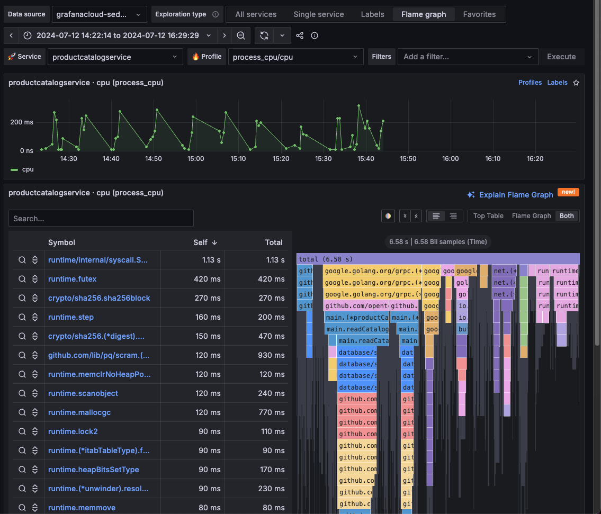
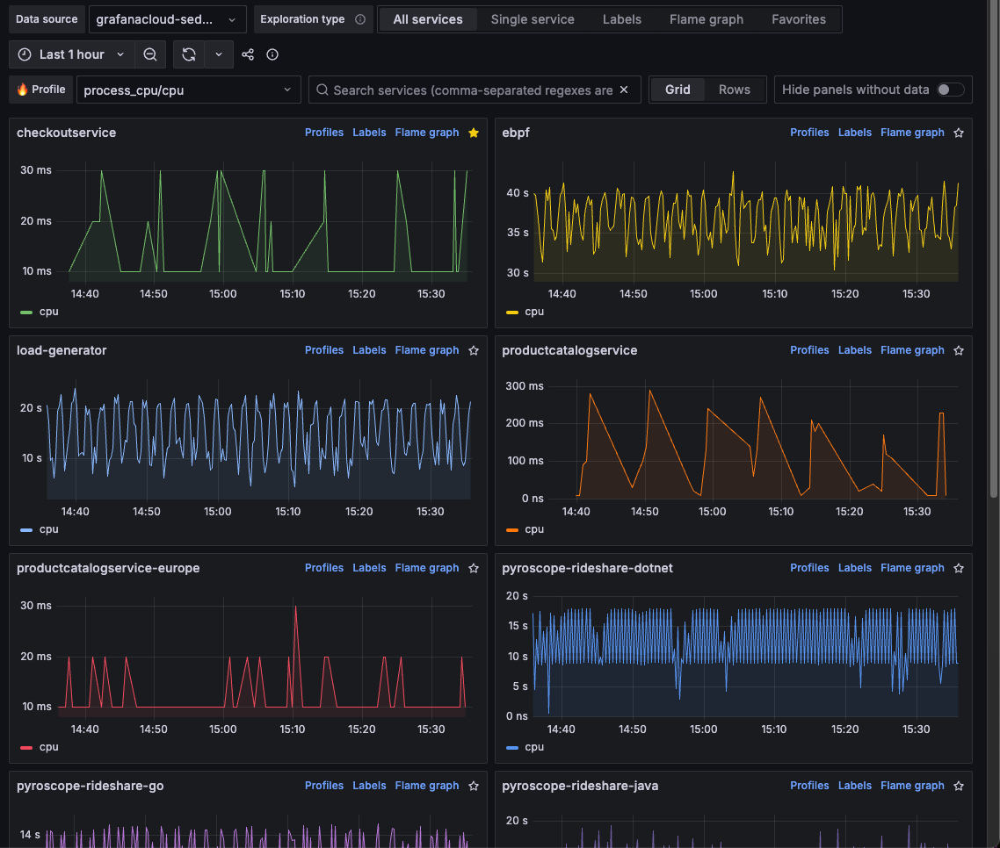
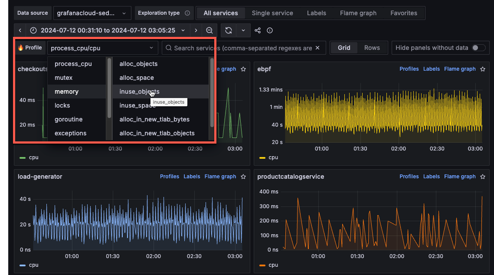

---
cascade:
  FULL_PRODUCT_NAME: Grafana Explore Profiles
  PRODUCT_NAME: Explore Profiles
description: Learn how to use Explore Profiles to understand and troubleshoot
  your application and services.
keywords:
  - Explore Profiles
  - Profiles
title: Explore Profiles
menuTitle: Explore Profiles
weight: 100
---

<!-- Use this for the product name  -->

# Explore Profiles

Profiling is a technique used in software development to measure and analyze the runtime behavior of a program.
By profiling a program, developers can identify which parts of the program consume the most resources, such as CPU time, memory, or I/O operations.
You can use this information to optimize the program, making it run faster or use fewer resources.

Explore Profiles provides an intuitive interface for exploring your profile data.
This design lets you navigate the UI and drill down into which tags are most interesting to you.
This app helps you start at the highest level possible and drill down into a specific root cause analysis.
You don’t know what’s wrong, but you should be able to find it by drilling down.

## Key features

Using Explore Profiles, you can:

* View high-level service performance: Get a high-level view of all of your services and how they're functioning
* Optimize processes: Identify processes or services that you can optimize for better performance
* Diagnose issues: Determine the root cause of an issue

## Concepts

Explore Profiles uses some key concepts for profiling:

* Profile data hierarchy
* Profile types
* Labels and tags
* Flame graphs

### Profile data hierarchy

Each profile has data for services. A service can be one of the processes running on your system or application.

Each service has multiple profile types, such as CPU, memory, exceptions, and locks. These profiles provide details about processes within a service.

* Service:  This is the main application or system you are monitoring. For example, it could be an online shopping platform, a social media application, or a cloud storage service
  * Profile type: Each service can be monitored through different profile types, each focusing on a specific performance aspect. Example profile types:
    * Cpu
    * allocated memory
    * in-use memory
    * goroutines
  * Labels: These are tags or descriptors that provide additional context to the profile types. Labels help categorize and filter the data for easier analysis. For example:
    * Namespace:
    * Pod
    * Instance
    * IP
    * Region

### Profile types

In Grafana Cloud Profiles and Pyroscope, profiling types refer to different dimensions of application performance analysis, focusing on specific aspects like CPU usage, memory allocation, or thread synchronization.

For more information, refer to [Understand profiling types](https://grafana.com/docs/grafana-cloud/monitor-applications/profiles/introduction/profiling-types/).
<!-- vale Grafana.Spelling = NO -->
| Profile type | What it shows | When to use |
|---|---|---|
| CPU profiling | Measures the amount of CPU time consumed by different parts of your application code | To identify and optimize CPU-intensive functions |
| Memory allocation  | Tracks the amount and frequency of memory allocations by the application | For identifying and optimizing memory usage patterns |
| Goroutine | Measures the usage and performance of lightweight routines in Go | Especially useful in Go applications for concurrency management |
| Contentions (Mutex) | Mutex profiling involves analyzing mutex (mutual exclusion) locks, used to prevent simultaneous access to shared resources. | To optimize thread synchronization and reduce lock contention |
| Block | Measures the frequency and duration of blocking operations, where a thread is paused or delayed | To identify and reduce blocking delays |
<!-- vale Grafana.Spelling = NO -->

### Tags and labels

Tags and labels help identify parts of profiling data. For example, labels identify Kubernetes Pod names, namespaces, repositories, references, and more.

This feature is crucial for identifying performance anomalies and understanding the behavior of different application segments under various conditions.

### Flame graphs

A fundamental aspect of continuous profiling is the flame graph, a convenient way to visualize performance data. These graphs provide a clear, intuitive understanding of resource allocation and bottlenecks within the application.

You can use a flame graph visualization if you need to:

* Identify any performance hot spots to find where code optimizations may be needed.
* Diagnose the root cause of any performance degradation.
* Analyze the behavior of complex systems, including distributed systems or microservices architectures.

To learn more, refer to the [Flame graph documentation](https://grafana.com/docs/grafana-cloud/monitor-applications/profiles/flamegraphs/). To learn more about the flame graph user interface, refer to [Flame graph visualization panel](https://grafana.com/docs/grafana-cloud/visualizations/panels-visualizations/visualizations/flame-graph).

## Before you begin

To use Explore Profiles, you need:

* A Grafana Cloud account
* A Grafana stack in Grafana Cloud with a configured Hosted profiles or Pyroscope data source

## Investigate issues using profile data

Profiles can help you identify errors in your apps and services. Using this information, you can optimize and streamline your apps.

In both use cases, your investigation begins with the big picture and then drills down.

When you start investigating an issue, you may either know what's wrong (for example, you know the affected service or that there’s too much CPU usage), or you may want to explore data.
This can lead you to two different starting points:

* Use case 1 - You know which service has issues and you need to investigate why.
* Use case 2 - You know there's a problem, but you need to locate where it is and the cause

Your use case determines what’s most important. If a service is misbehaving, then you might want to see the profile types so you can see the CPU and memory profiles alongside each other.

For either use case, the first step is to identify areas of interest by reviewing profiles or a single service.
Selecting different profile types lets you focus on memory allocation, CPU processes, allocation sizes, blocks, and more.

After you’ve identified the problem process or service, you can filter and explore using labels and flame graphs to view lower levels.

### Use case 1: Know the problem service, not the cause

If you know the affected service (use case 1), your investigation starts by viewing that service using the **Services** view and reviewing the profiles for that service. In the first scenario, you may have identified that the `checkoutservice` has an issue. You can select `checkoutservice` and then use the Single service view to examine all profiles for that service.

### Use case 2: Know there is an issue, need to investigate

If you only know there is an issue and have to investigate, then your investigation starts by using the **All services** view. Using the Profile selector, you can check the services’ CPU processes, memory allocation, blocks, locks, exceptions, and other available profile types.

After you locate the profile with a spice, select either **Profiles** to change to **Single service** view and examine all profile types for that service or select **Labels** to view the labels (such as `hostname` or `span_name`) for that service.

## Choose a view

The available views correspond to how you move through your data: from wide to more specific.
For example, you can start with **All services** and then move to **Single service** or **Labels** for more specific views into your data.
This matches the hierarchy of the profiling data.

Determining which view to use is one of the first steps in an investigation.
<!-- Uses HTML table because of bulleted lists in table cells. -->
<table>
  <tr>
   <td>View
   </td>
   <td>What it shows
   </td>
   <td>Used for
   </td>
  </tr>
  <tr>
   <td>All services
   </td>
   <td>Overview of all services for any given profile metric
   </td>
   <td>
<ul>

<li>Reviewing all the services that are being profiled

<li>Finding an anomalous service out of all services (or set of related services) by profile type
</li>
</ul>
   </td>
  </tr>
  <tr>
   <td>Single service
   </td>
   <td>Overview of all the profile metrics for a single service
   </td>
   <td>
<ul>

<li>Analyzing the performance of a single service across all profile types

<li>Finding relations of profile metric spikes across profile types (or discovering an anomalous metric)
</li>
</ul>
   </td>
  </tr>
  <tr>
   <td>Labels
   </td>
   <td>Single service label exploration and filtering
   </td>
   <td>
<ul>

<li>Analyzing profiling metrics of a single service and profiling type across all label dimensions

<li>Discovering anomalous profiling metrics by label
</li>
</ul>
   </td>
  </tr>
  <tr>
   <td>Flame graphs
   </td>
   <td>Single service flame graph
   </td>
   <td>
<ul>

<li>Analyze the flame graph of a particular service, profile type, and label selection

<li>Use tools like "Explain Flame Graph" or "GitHub Code View" (aka "Function Details") to get deeper insights into performance
</li>
</ul>
   </td>
  </tr>
  <tr>
   <td>Favorites
   </td>
   <td>List of visualizations saved as favorites
   </td>
   <td>
<ul>

<li>Save frequently accessed panels for quick access
</li>
</ul>
   </td>
  </tr>
</table>

## Use Explore Profiles

When you use Explore Profiles, your investigations follow these general steps:

1. Verify your data source in the Data source drop-down.
1. Choose an **Exploration** type. **All services** is selected by default.
1. Look for spikes or trends in the services to help identify issues. Use the **Profiles** drop-down to change profile types.
  
1. After you identify the service to explore, you can change views:
   * Select **Profiles** to review the profiles for a service
   * Select **Labels** to view the labels for a service. The Labels view helps you gain an understanding at an aggregated service level.
   * Select **Flame graph** to view the flame graph for a service
1. Optional: Select filters to hone in on the problem areas. Each filter you select is added to the Filters statement at the top of the page. You can select filters in the following ways:
   * Use the filter drop-downs in the Filters bar to add services and operators. Use **Execute** to run the filter.
   * From the Labels view: Select** Add to filters **from one of the areas of interest.
1. Optional: Click and drag on any graph to select a specific time frame or data range.
1. Use the **Labels** view to select two processes to compare.
   * Select the checkbox in two graphs. Select **Compare** to view your selections in the **Comparison diff view**.
   * Use the **Service** and **Profile** drop-downs to change the service or profile type displayed.
1. Use the **Flame graph** view to drill into the code level to pinpoint issues in specific functions, for example.
  
