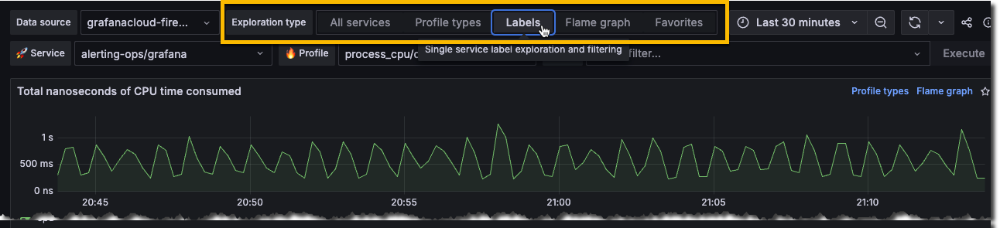
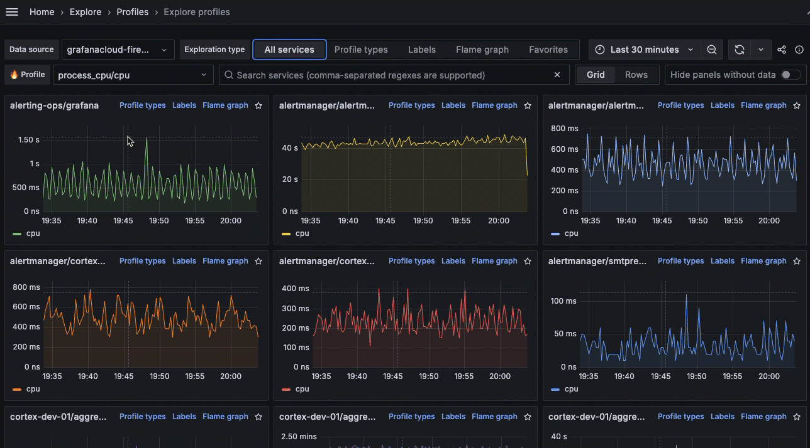

# Choose a view

The available views in Explore Profiles correspond to how you move through your data: from broader to more specific.
For example, you can start with **All services** and then move to **Profile types** or **Labels** for more specific views into your data.

This matches the hierarchy of the [profiling data](../concepts/).

After you choose a view, you can [Investigate trends and spikes](../investigate/).

## Select a view

Select a view by choosing an Exploration type: **All services**, **Profile types**, **Labels**, or **Flame graph**.

You can refine any selected views by selecting a Profile type, Label, or Flame graph from one of the charts.
Click and drag on an area of interest to see more detail.

## Available views

Determining which view to use frames the rest of your investigation.

<!-- Uses HTML table because of bulleted lists in table cells. -->
<table>
  <tr>
   <td>View
   </td>
   <td>What it shows
   </td>
   <td>Used for
   </td>
  </tr>
  <tr>
   <td>All services
   </td>
   <td>Overview of all services for any given profile metric
   </td>
   <td>
<ul>

<li>Reviewing all the services that are being profiled

<li>Finding an anomalous service out of all services (or set of related services) by profile type
</li>
</ul>
   </td>
  </tr>
  <tr>
   <td>Profile types
   </td>
   <td>Overview of all the profile metrics for a single service
   </td>
   <td>
<ul>

<li>Analyzing the performance of a single service across all profile types

<li>Finding relations of profile metric spikes across profile types (or discovering an anomalous metric)
</li>
</ul>
   </td>
  </tr>
  <tr>
   <td>Labels
   </td>
   <td>Single service label exploration and filtering
   </td>
   <td>
<ul>

<li>Analyzing profiling metrics of a single service and profiling type across all label dimensions

<li>Discovering anomalous profiling metrics by label
</li>
</ul>
   </td>
  </tr>
  <tr>
   <td>Flame graphs
   </td>
   <td>Single service flame graph
   </td>
   <td>
<ul>

<li>Analyze the flame graph of a particular service, profile type, and label selection

<li>Use tools like "Explain Flame Graph" or "GitHub Code View" (aka "Function Details") to get deeper insights into performance
</li>
</ul>
   </td>
  </tr>
  <tr>
   <td>Favorites
   </td>
   <td>List of visualizations saved as favorites
   </td>
   <td>
<ul>

<li>Save frequently accessed panels for quick access
</li>
</ul>
   </td>
  </tr>
</table>

## Exploration type examples

### All services view

The **All services** view is the default view when you first open Explore Profiles.

### Profile types

The Profile types shows one chart for each profile available for the selected service.

### Labels

### Flame graphs

