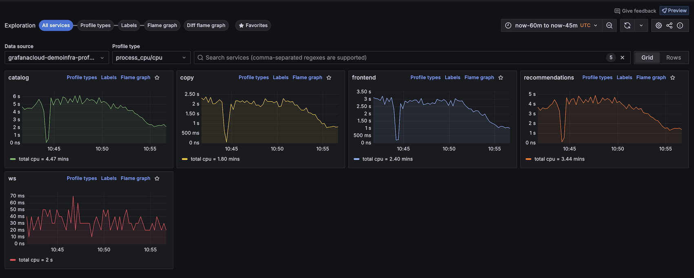
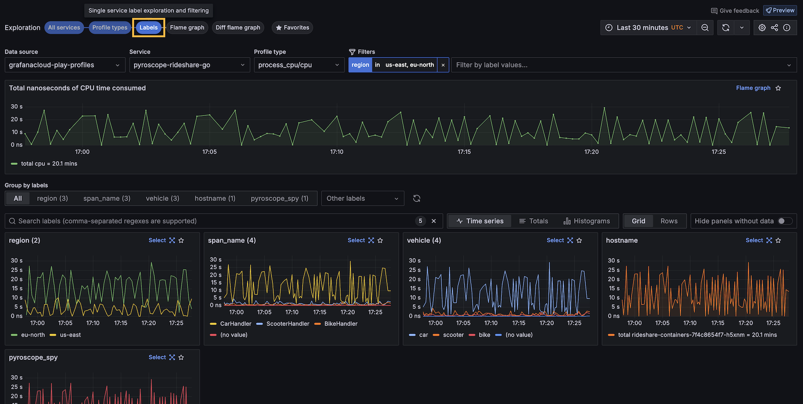

# Choose a view

The available views in Explore Profiles correspond to how you move through your data: from broader to more specific.
For example, you can start with **All services** and then move to **Profile types** or **Labels** for more specific views into your data.

This matches the hierarchy of the [profiling data](../concepts/).

After you choose a view, you can [Investigate trends and spikes](../investigate/).



## Select a view

Select a view by choosing an **Exploration**: **All services**, **Profile types**, **Labels**, **Flame graph**, or **Diff flame graph**.

<!-- screenshots need to be updated -->

You can refine any selected views by selecting a Profile type, Label, or Flame graph from one of the charts.
Click and drag on an area of interest to see more detail.

## Available views

Determining which view to use frames the rest of your investigation.

<!-- Uses HTML table because of bulleted lists in table cells. -->
<table>
  <tr>
   <td>View
   </td>
   <td>What it shows
   </td>
   <td>Used for
   </td>
  </tr>
  <tr>
   <td>All services
   </td>
   <td>Overview of all services for any given profile metric
   </td>
   <td>
<ul>

<li>Reviewing all the services that are being profiled

<li>Finding an anomalous service out of all services (or set of related services) by profile type
</li>
</ul>
   </td>
  </tr>
  <tr>
   <td>Profile types
   </td>
   <td>Overview of all the profile metrics for a single service
   </td>
   <td>
<ul>

<li>Analyzing the performance of a single service across all profile types

<li>Finding relations of profile metric spikes across profile types (or discovering an anomalous metric)
</li>
</ul>
   </td>
  </tr>
  <tr>
   <td>Labels
   </td>
   <td>Single service label exploration and filtering
   </td>
   <td>
<ul>

<li>Analyzing profiling metrics of a single service and profiling type across all label dimensions

<li>Discovering anomalous profiling metrics by label
</li>
</ul>
   </td>
  </tr>
<tr>
  <td>Flame graph
   </td>
   <td>Single service flame graph
   </td>
   <td>
<ul>

<li>Analyze the flame graph of a particular service, profile type, and label selection

<li>Use tools like **Explain flame graph**, GitHub code view, and Function details to get deeper insights into performance.
</li>
</ul>
   </td>
  </tr>
<tr>
  <td>Diff flame graph
   </td>
   <td>Compare the differences between two flame graphs
   </td>
   <td>
<ul>

<li>Compare queries that may have different total amounts of time spent in each function

</ul>
   </td>
  </tr>
  <tr>
   <td>Favorites
   </td>
   <td>List of visualizations saved as favorites
   </td>
   <td>
<ul>

<li>Save frequently accessed panels for quick access
</li>
</ul>
   </td>
  </tr>
</table>

## Exploration type examples

### All services view

The **All services** view is the default view when you first open Explore Profiles.

### Profile types

The Profile types shows one chart for each profile available for the selected service.
You can select to display the charts in a grid or one chart per row.

### Labels

The Labels view lets you navigate and analyze performance data through labels.
This feature is crucial for identifying performance anomalies and understanding the behavior of different application segments under various conditions.

### Flame graphs

The Flame graph view visualizes profiling data of a single service in a flame graph format, allowing easy identification of resource-intensive functions.

On views with a flame graph, you can use **Explain flame graph** to provide an AI flame graph analysis that explains the performance bottleneck, root cause, and recommended fixes.
For more information, refer to [Flame graph AI](https://grafana.com/docs/grafana-cloud/monitor-applications/profiles/flamegraph-ai/).

You can also use line-level insights from the [GitHub integration](https://grafana.com/docs/grafana-cloud/monitor-applications/profiles/pyroscope-github-integration/).

### Diff flame graph

The **Diff flame graph** view shows the differences between two profiling data sets.
It normalizes the data by comparing the percentage of total time spent in each function so that the resulting flame graph is comparing the share of time spent in each function rather than the absolute amount of time spent in each function.
This lets you compare two different queries that may have different total amounts of time spent in each function.

Similar to a `git diff`, it takes the selected flame graphs and highlights the differences between them.

<!-- from old screenshot of cpu usage profile Red represents an increase in CPU usage from the baseline to the comparison and green represents a decrease. -->

### Favorites

The **Favorites** view shows all your favorited visualizations. 
Clicking on the star (⭐️) at the top-right corner of a visualization saves it as a favorite.

This feature helps you creating an overview of what's important, as well as offering the possibility to quickly jump to the **Flame graph** view or the **Labels** view.

