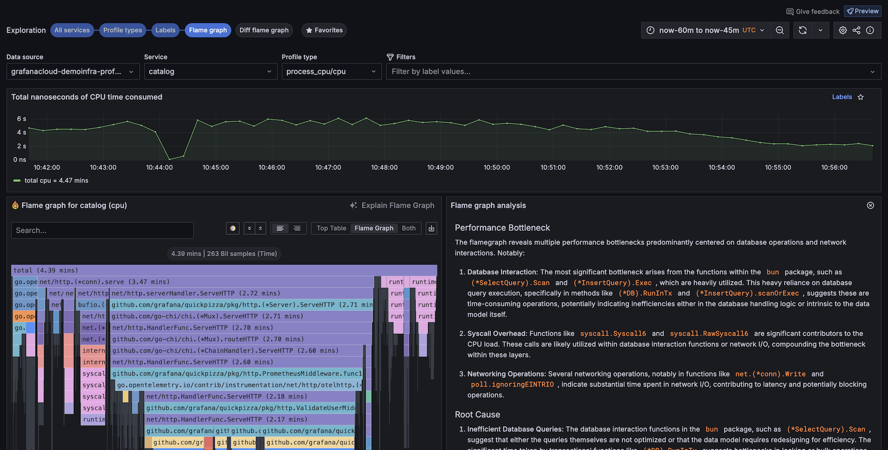

# Concepts

To use profiling, you should understand these concepts:

- Profile data hierarchy
- Profile types
- Labels
- Flame graphs

## Profile data hierarchy

Each profile has data for services. A service can be one of the processes running on your system or application.

Each service has multiple profile types, such as CPU, memory, exceptions, and locks. These profiles provide details about the processes in a service.

- Service: This is the main application or system you are monitoring. For example, it could be an online shopping platform, a social media application, or a cloud storage service.
  - Profile type: You can monitor each service through different profile types, each focusing on a specific performance aspect. Example profile types:
    - CPU
    - allocated memory
    - in-use memory
    - goroutines
  - Labels: These are tags or descriptors that provide additional context to the profile types. Labels help categorize and filter the data for easier analysis. For example:
    - Namespace:
    - Pod
    - Instance
    - IP
    - Region

## Profile types

Profile types refer to different dimensions of application performance analysis, focusing on specific aspects like CPU usage, memory allocation, or thread synchronization.

For more information, refer to [Understand profiling types](https://grafana.com/docs/grafana-cloud/monitor-applications/profiles/introduction/profiling-types/).

<!-- vale Grafana.Spelling = NO -->

| Profile type        | What it shows                                                                                                               | When to use                                                     |
| ------------------- | --------------------------------------------------------------------------------------------------------------------------- | --------------------------------------------------------------- |
| CPU profiling       | Measures the amount of CPU time consumed by different parts of your application code                                        | To identify and optimize CPU-intensive functions                |
| Memory allocation   | Tracks the amount and frequency of memory allocations by the application                                                    | For identifying and optimizing memory usage patterns            |
| Goroutine           | Measures the usage and performance of lightweight routines in Go                                                            | Especially useful in Go applications for concurrency management |
| Contentions (Mutex) | Mutex profiling involves analyzing mutex (mutual exclusion) locks, used to prevent simultaneous access to shared resources. | To optimize thread synchronization and reduce lock contention   |
| Block               | Measures the frequency and duration of blocking operations, where a thread is paused or delayed                             | To identify and reduce blocking delays                          |

<!-- vale Grafana.Spelling = NO -->

## Labels

Labels help identify parts of profiling data. For example, labels identify Kubernetes Pod names, namespaces, repositories, and references. You can also create custom labels.

This feature is crucial for identifying performance anomalies and understanding the behavior of different application segments under various conditions.

## Flame graphs

A fundamental aspect of continuous profiling is the flame graph, a convenient way to visualize performance data. These graphs provide a clear, intuitive understanding of resource allocation and bottlenecks in the application.

You can use a flame graph visualization if you need to:

- Identify any performance hot spots to find where code optimizations may be needed.
- Diagnose the root cause of any performance degradation.
- Analyze the behavior of complex systems, including distributed systems or microservices architectures.

To learn more, refer to the [Flame graph documentation](https://grafana.com/docs/grafana-cloud/monitor-applications/profiles/flamegraphs/).
To learn more about the flame graph user interface, refer to [Flame graph visualization panel](ref:flame-graph-ui).

