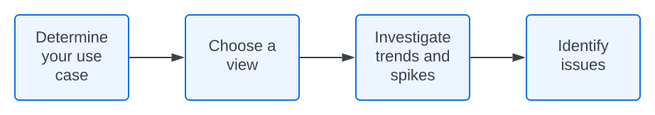

# Get started with Explore Profiles



Profiles can help you identify errors in your apps and services.
Using this information, you can optimize and streamline your apps.

Your investigation begins with the big picture and then drills down using profile types, labels, and flame graphs to explore your data. To learn more, refer to [Concepts](../concepts/).

To learn more about Explore Profiles, read [The new, queryless UI for Grafana Pyroscope: Introducing Explore Profiles](https://grafana.com/blog/2024/07/18/the-new-queryless-ui-for-grafana-pyroscope-introducing-explore-profiles/).

<!-- Needs to be updated -  -->


Expand your observability journey and learn about [Explore Traces](https://grafana.com/docs/grafana-cloud/visualizations/simplified-exploration/traces/).


## Before you begin

To use Explore Profiles with Grafana Cloud, you need:

- A Grafana Cloud account
- A Grafana stack in Grafana Cloud with a configured Hosted profiles or Pyroscope data source

To use Explore Profiles with Grafana open source, you need:

- Your own Grafana instance
- Install [Explore Profiles plugin](https://grafana.com/grafana/plugins/grafana-pyroscope-app/)

## Explore your profile data

Most investigations follow four general steps:

1. [Determine your use case](../determine-use-case/).
1. [Choose a view](../choose-a-view/).
1. [Investigate trends and spikes](../investigate/).
1. Identify issues, as the result of your investigation.


