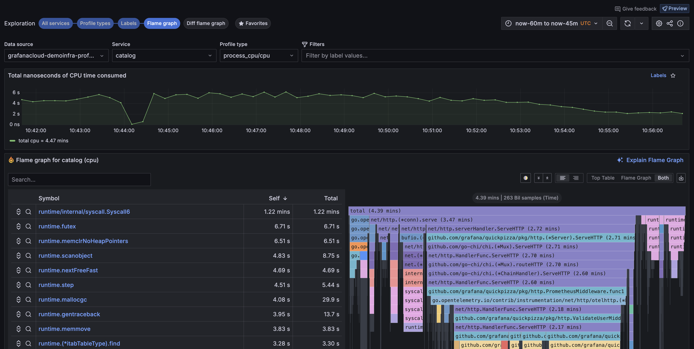

# Investigate trends and spikes

Explore Profiles provides powerful tools that help you identify and analyze problems in your applications and services.

Using these steps, you can use the profile data to investigate issues.



## Explore your profile data

When you use Explore Profiles, your investigations follow these steps.

1. Verify your data source in the **Data source** drop-down.
1. Choose an **Exploration** type. **All services** is selected by default. Learn about the [available views](../choose-a-view/).
1. Look for spikes or trends in the services to help identify issues. Use the **Profiles** drop-down to change profile types.
   
1. After you identify the service to explore, you can change views:
   - Select **Profiles** to review the profiles for a service.
   - Select **Labels** to view the labels for a service. The Labels view helps you gain an understanding at an aggregated service level.
   - Select **Flame graph** to view the flame graph for a service.
1. Optional: Select filters to hone in on the problem areas. Each filter you select is added to the Filters statement at the top of the page. You can select filters in the following ways:
   - Use the filter drop-downs in the Filters bar to add services and operators. Use **Execute** to run the filter.
   - From the Labels view: Select **Add to filters** from one of the areas of interest.
1. Optional: Click and drag on any graph to select a specific time frame or data range.
1. Use the **Labels** view to select two processes to compare.
   - Select the checkbox in two graphs. Select **Compare** to view your selections in the **Comparison diff view**.
   - Use the **Service** and **Profile** drop-downs to change the service or profile type displayed.
1. Use the **Flame graph** view to drill into the code level to pinpoint issues in specific functions, for example.
   
